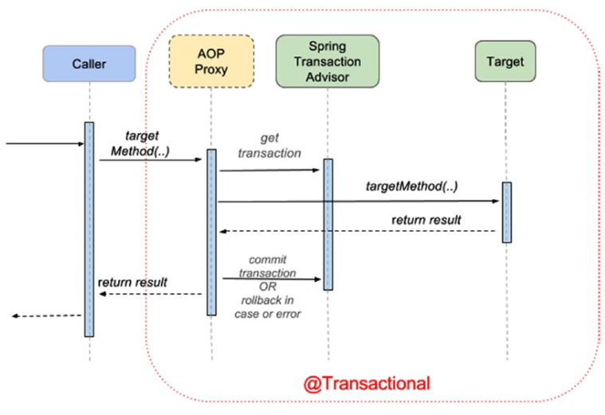

Context:
- `AutowiredAnnotationBeanPostProcessor`
- `DefaultSingletonBeanRegistry`
- `InfrastructureAdvisorAutoProxyCreator`

Data:
- `TransactionInterceptor`
- `EnableTransactionManagement`
- `TransactionManagementConfigurer` - allows setting default transaction manager when more than one is available (`@Primary` can also be used)
- `SqlInitializationProperties` - contains default location for [database initialization](https://docs.spring.io/spring-boot/docs/current/reference/htmlsingle/#howto.data-initialization.using-basic-sql-scripts) locations:
  - schema.sql
  - data.sql
  - schema-${platform}.sql
  - data-${platform}.sql \
    where platform: `all`, `h2` `postgres`, etc
- `@Transactional`
- `@Commit`
- `@Rollback`
- `@BeforeTransaction`
- `@AfterTransaction`
- `@Sql`
- `@SqlConfig`
- `@SqlGroup`

Transaction Managers:
- `DataSourceTransactionManager` - basic transaction management provider used with JDBC and MyBatis
- `HibernateTransactionManager`
- `JpaTransactionManager`
- `JtaTransactionManager` - used to delegate transaction management to a Java EE server. Can be also used with Atomikos
- `WebLogicJtaTransactionManager`

