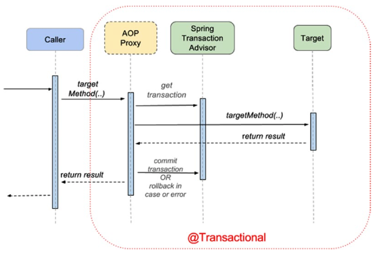

Beans:
@Resource == @Autowired + @Qualifier
@Named == @Component
@Autowired == @Inject
@Import vs @ContextConfiguration, @Import adds beans to current configuration, @ContextConfiguration overrides the whole context

Context:
- `AutowiredAnnotationBeanPostProcessor`
- `DefaultSingletonBeanRegistry`
- `InfrastructureAdvisorAutoProxyCreator`

Configurationap:
- `PropertySourcesPlaceholderConfigurer`

Mapping rows:
- `RowCallbackHandler` - when no value should be returned.
- `RowMapper` - when each row of the ResultSet maps to a domain object.
- `RowSetExtractor` - when **multiple** rows of the ResultSet maps to a single object.
- `ParameterizedRowMapper` complex object creation

Data:
- `TransactionInterceptor`
- `EnableTransactionManagement`
- `TransactionManagementConfigurer` - allows setting default transaction manager when more than one is available (`@Primary` can also be used)
- `SqlInitializationProperties` - contains default location for [database initialization](https://docs.spring.io/spring-boot/docs/current/reference/htmlsingle/#howto.data-initialization.using-basic-sql-scripts) locations:
  - schema.sql
  - data.sql
  - schema-${platform}.sql
  - data-${platform}.sql \
    where platform: `all`, `h2` `postgres`, etc
- `@Transactional`
- `@Commit`
- `@Rollback`
- `@BeforeTransaction`
- `@AfterTransaction`
- `@Sql`
- `@SqlConfig`
- `@SqlGroup`

Transaction Managers:
- `DataSourceTransactionManager` - basic transaction management provider used with JDBC and MyBatis
- `HibernateTransactionManager`
- `JpaTransactionManager`
- `JtaTransactionManager` - used to delegate transaction management to a Java EE server. Can be also used with Atomikos
- `WebLogicJtaTransactionManager`

Web:
- `MessageConverter`
- ``
- Handler method: can have parameters:
  - Model, ModelMap, RedirectAttributes, @ModelAttribute, @SessionAttribute, @RequestAttribute
  - @Validated, BindingResult - provides validation errors
  - java.io.InputStream
  - java.io.Reader
  - PushBuilder - HTTP2 resource push
  - java.security.Principal
  - WebRequest, NativeWebRequest, javax.servlet.ServletRequest
  - javax.servlet.ServletResponse
  - HttpMethod
  - Locale
  - @RequestParam, @PathVariable, @RequestHeader, @MatrixVariable, @CookieValue
  - String, CharSequence, Date, Temporal, URI, URL (treated as if they are annotated with @RequestParam)
- Handler method: annotations:
  - @RequestMapping, @GetMapping, etc.
  - @ResponseStatus
- Handler method: return type:
  - void (no response or when the response is written directly to ServletResponse)
  - ModelAndView

View technologies that Spring supports by default: JSP, Velocity templates, XSLT views. View is resolved automatically 
when the return type is one of: `String`, `View` or `ModelAndView`. The default resolver is `InternalResourceViewResolver`. See
`DispatcherServlet.properties` for more default configurations.

`ViewResolver` - resolves string to a view:
  - `ContentNegotiatingViewResolver` - can be used when 2 views has the same name. The returned view might depend on 
    distinct url, `Accept` header, Request params
  - `ContentNegotiationManagerFactoryBean` 
  - `ContentNegotiationManager`
  - url can start with `redirect:` or `forward:`

`WebInitializer`, `WebAppInitializer`
`AbstractAnnotationConfigDispatcherServletInitializer`, `HandlerExceptionResolver`, `@ExceptionHandler`, `@ControllerAdvice`
`WebMvcConfigurer`

`@WebMvcTest` - bootstraps beans only relevant to MVC under test
`@AutoConfigureMockMvc` - can be used with @SpringBootTest to boostrap full application context.

- Path variable (i.e. {id}) can be defined in the class level @RequestMapping

- `RestTemplate::setErrorHandler`
- Request details can be accessed by `@Value`, i.e. `@Value("#{request.requestURL}) StringBuffer originalUrl`
- `UriTemplate`
- `AuthenticationEntryPoint`

Actuator:
  - /actuator
  - `HealthIndicator`, `HealthStatusHttpMapper`
  - `@Endpoint`, `@ReadOperation`, `@WriteOperation`, `@DeleteOperation`, `@JmxEndpoint`, `@WebEndpoint`, `@Selector`
  

Security:
- `Principal` - signifies the user, device or system that could perform an action within an application
- `Credetials` - identification keys used by a principal to confirm its identity
- `SecurityContextPersistenceFilter` - filter which sets/clears `SecurityContextHolder`
- `WebSecurityConfigurerAdapter`, `WebSecurityConfigurer` - means to customize default security configuration, replaces xml configuration  
- `AuthenticatedVoter`
- `@EnableWebSecurity`, `@EnableGlobalMethodSecurity`, `@Secured("ROLE_ADMIN")`, jsr250 `@RolesAllowed("ROLE_ADMIN")`
- `@EnableGlobalMethodSecurity(prePostEnabled = true)`:
  - `@PreAuthorize`, `@PreFilter`, `@PostAuthorize`, `@PostFilter`, these supports SpEL expressions:
    - `@PreAuthorize("hasRole('ROLE_ADMIN'))`
    - `@PreAuthorize("hasPermission(#user, 'admin'))`
    - `@PreAuthorize("#user.username == authentication.name")`

